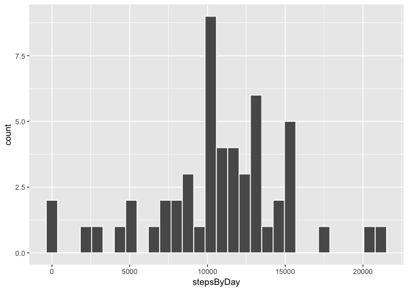
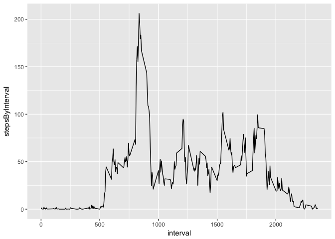
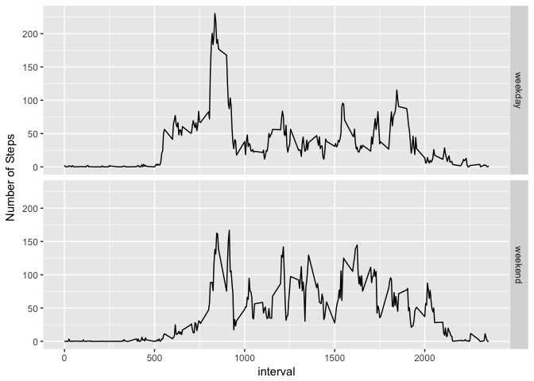

# Reproducible Research: Peer Assessment 1


## Loading and preprocessing the data
We load the data from the file "activity.csv" by function read.csv(). The data contain three columns:   
1. steps(int),   
2. date(Factor),    
3. interval(int).    
Each day contains 288 intervals. Then we use tapply to make a new dataframe act_day which contain two columns (stepsByDay, day)


```r
data <- read.csv("activity.csv")
stepsByDay <- tapply(data$steps, data$date, sum)
day <- unique(data$date)
act_day <- data.frame(stepsByDay, day)
```

## What is mean total number of steps taken per day?

First we use ggplot2 system to plot the histogram of the total number of steps taken each day.  
Then we use function summary() to get the statistical information of act_day. We can find the mean total number of steps taken per day is *10770*, the median total number of steps taken per day is *10760*.Now we ignore all the NA values.


```r
library("ggplot2")
gd <- ggplot(act_day, aes(stepsByDay))
gd + geom_histogram(na.rm=TRUE,col="white")
```

```
## `stat_bin()` using `bins = 30`. Pick better value with `binwidth`.
```

<!-- -->

```r
summary(act_day$stepsByDay)
```

```
##    Min. 1st Qu.  Median    Mean 3rd Qu.    Max.    NA's 
##      41    8841   10760   10770   13290   21190       8
```


## What is the average daily activity pattern?
We use the tapply to count the average steps per inteval and create a new dataframe for stepsByInteval and intevals. Then we use ggplot2 library generate a time series plot of the 5-minute interval (x-axis) and the average number of steps taken, averaged across all days (y-axis). The maximum number of steps over average 5 minutes interval is 206.1698  (by max() function)


```r
stepsByInterval <- tapply(data$steps, data$interval, mean,na.rm=TRUE)
interval <- unique(data$interval)
act_interval <- data.frame(stepsByInterval, interval)
library("ggplot2")
gi <- ggplot(act_interval, aes(interval,stepsByInterval))
gi + geom_line()
```

<!-- -->

```r
max(act_interval$stepsByInterval)
```

```
## [1] 206.1698
```
## Imputing missing values
There are total 2304 of missing values in the dataset. Because the activity of human being has period of day, such as there usually is 0 step on half-night. So we use the mean for that 5-minute interval to replace the missing values in the dataset(We use match() function to accomplish the trick) .  
We resummary the new data, find the mean total number of steps taken per day is 10770, the median total number of steps taken per day is also 10770.   
Imputing missing data doesn't change the mean value, but increase the median value a little.


```r
#Count the NA records in raw data.
sum(is.na(data$steps))
```

```
## [1] 2304
```

```r
#replace the missing value with the mean for that 5-minute interval
newdata <- data
newdata$steps[is.na(newdata$steps)] <-act_interval$stepsByInterval[match(newdata$interval[is.na(newdata$steps)],interval)]
#rebuild the act_day data frame 
newstepsByDay <- tapply(newdata$steps, newdata$date, sum)
day <- unique(data$date)
newact_day <- data.frame(newstepsByDay, day)
#draw the histogram by stepsByDay
library("ggplot2")
gnd <- ggplot(act_day, aes(stepsByDay))
gnd + geom_histogram(col="white")
```

```
## `stat_bin()` using `bins = 30`. Pick better value with `binwidth`.
```

```
## Warning: Removed 8 rows containing non-finite values (stat_bin).
```

<!-- -->

```r
#count the summary
summary(newact_day$newstepsByDay)
```

```
##    Min. 1st Qu.  Median    Mean 3rd Qu.    Max. 
##      41    9819   10770   10770   12810   21190
```
## Are there differences in activity patterns between weekdays and weekends?
In order to compate the activity patterns between weekdays and weekends, we add a new factor column dayType to the newdata. We write the weekFactor function and use sapply to generate the weekday factor for each row. In order to tapply by two factors is a little trick, there will be a better solution.    
We draw the time series plot average step per inteval for weekday and weekend. From the picture we can see that people get up later in weekend thant in weekdays, and has more activities in the afternoon and night. 


```r
weekFactor <- function(x) {
  ret = "weekday"
  if(weekdays(as.Date(x)) %in% c("星期六","星期日"))
    ret = "weekend"
  ret
}
newdata$dayType <- sapply(newdata$date,weekFactor)
stepsByInterval <- with(newdata, tapply(steps, list(interval, dayType), mean))
#here is a little trick to transfer the matrix to data.frame
new_act_interval <- data.frame(c(interval,interval),c(stepsByInterval[,"weekday"],stepsByInterval[,"weekend"]),c(rep("weekday",288),rep("weekend",288)))
colnames(new_act_interval) <- c("interval","steps","weekFactor")
#draw the plot to compare patterns between days and 
gnai <- ggplot(new_act_interval,aes(interval,steps))
gnai + geom_line() + facet_grid(weekFactor ~ .) + labs(y = "Number of Steps")
```

<!-- -->
